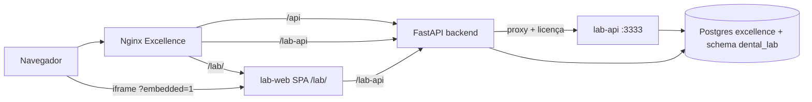

# Fase 4 — Integração com Excellence Dental Cloud

Mapa do que **já existe** no monorepo `Excellence_Dental` e o que **falta** para fechar a integração com `dental-lab-system`.

> Repositórios irmãos esperados na VPS:
> `.../Excellence_Dental` e `.../dental-lab-system`

---

## Arquitetura alvo (embedded)



---

## Já implementado no Excellence

| Componente | Local | Notas |
|------------|-------|-------|
| Proxy BFF `/lab-api/{path}` | `backend/main.py` | Injeta `X-Dental-Lab-License`, `X-Clinica-Id`, repassa JWT |
| `GET /lab/module-status` | `backend/main.py` | Feature flag + licença configurada |
| Rota dashboard | `frontend/src/routes/dashboard/laboratorio.tsx` | Lazy load `LaboratorioProducao` |
| Menu Laboratório | `frontend/src/routes/dashboard.tsx` | Só se `VITE_LAB_MODULE_ENABLED=true` |
| Iframe SPA | `frontend/src/components/LaboratorioProducao.tsx` | `/lab/?embedded=1` |
| Nginx `/lab-api/` → backend | `infra/nginx/default.conf` | |
| Serviços Docker `lab-api`, `lab-web` | `docker-compose.prod.yml` | Profile `lab` |
| Deploy lab na VPS | `infra/ops/deploy-lab-hetzner.ps1` | |
| Smoke embedded | `infra/ops/smoke-lab-embedded.ps1` | |
| Guia rápido | `infra/LAB_MODULE_READY.md` | |

## Já implementado no dental-lab-system

| Componente | Local |
|------------|-------|
| Modo `embedded` na API | `DENTAL_LAB_DEPLOYMENT_MODE=embedded` |
| Validação JWT ERP | `apps/api/src/auth/embedded.ts` |
| Schema `dental_lab` + `clinica_id` | `apps/api/src/db/schema-postgres.sql` |
| Front embedded (`/lab-api`, base `/lab/`) | `apps/web/Dockerfile`, `.env.embedded` |
| Sessão no iframe | `apps/web/src/lib/auth.ts` — lê `token` e `clinica_id` do ERP (mesma origem) |
| Basename `/lab` + entrada em próteses | `apps/web/src/main.tsx`, `labPaths.ts`, `labModule.ts` |
| **Um** item Laboratório no ERP | `frontend/src/routes/dashboard.tsx` |
| Menu lab no iframe (sem hub duplicado) | `apps/web/src/App.tsx` — oculta `/laboratorio` se `IS_EMBEDDED` |

---

## Checklist operacional (você / agente Excellence)

### 1. Variáveis de ambiente

**`Excellence_Dental/.env.production`:**

```env
LAB_MODULE_ENABLED=true
DENTAL_LAB_LICENSE_KEY=<chave-forte-igual-no-lab-api>
SECRET_KEY=<já existente — usado como DENTAL_LAB_ERP_JWT_SECRET no lab-api>
```

**`dental-lab-system` (serviço lab-api no compose):**

```env
DENTAL_LAB_DEPLOYMENT_MODE=embedded
DENTAL_LAB_LICENSE_REQUIRED=true
DENTAL_LAB_LICENSE_KEY=<mesma chave>
DENTAL_LAB_ERP_JWT_SECRET=<SECRET_KEY do Excellence>
DENTAL_LAB_DATABASE_URL=postgresql://...@postgres:5432/excellence
DENTAL_LAB_ERP_DATABASE_URL=<mesma URL>
DENTAL_LAB_CORS_ORIGINS=https://seu-dominio.com
```

### 2. Subir stack com módulo lab

```bash
cd Excellence_Dental
docker compose -f docker-compose.prod.yml --profile lab up -d --build
```

Rebuild só lab (se já existir stack):

```powershell
pwsh ./infra/ops/deploy-lab-hetzner.ps1
```

### 3. Rebuild frontend Excellence

O menu **Laboratório** só aparece com build args:

- `VITE_LAB_MODULE_ENABLED=true`
- `VITE_LAB_WEB_URL=/lab/` (padrão no compose)

### 4. Validar smoke

```powershell
$env:SMOKE_ADMIN_PASSWORD='senha-do-admin-erp'
pwsh ./infra/ops/smoke-lab-embedded.ps1 -BaseUrl http://127.0.0.1
```

Esperado: login ERP → `/lab/module-status` enabled → `/lab-api/health` ok → `/lab-api/auth/me` → schema `dental_lab` no Postgres.

### 5. Teste manual no navegador

1. Login no Excellence.  
2. Abrir **Laboratório** em Gestão & Cadastros (único item do módulo lab no ERP).  
3. Iframe carrega `/lab/proteses?embedded=1`.  
4. Sem tela de login do lab (usa JWT do ERP).  
5. No menu **interno do iframe**, conferir Operação e Gestão & Cadastros (empresa, financeiro, colaboradores, …) — **sem** itens Lab · duplicados no menu do ERP.  
6. Criar uma prótese de teste e imprimir 3 vias.

**Se o iframe pedir login:** confirme mesma origem (mesmo host/porta), usuário logado no ERP, e build embedded do `lab-web`.

**Perfis no iframe:** `admin` e `recepcionista` do ERP veem a seção Gestão; demais perfis veem só o que o RBAC mapeado permitir.

---

## Pendências de produto (Fase 4 — negócio)

Estas **não** estão prontas; exigem trabalho nos dois sistemas:

| # | Funcionalidade | Onde implementar | Complexidade |
|---|----------------|------------------|--------------|
| 1 | **Sincronizar pacientes** ERP → lab | API Excellence: endpoint ou job que upsert em `dental_lab.clientes` por `clinica_id`; opcional webhook ao cadastrar paciente | Média |
| 2 | **Criar prótese da ficha do paciente** | Front Excellence: botão “Enviar ao laboratório” → POST `/lab-api/proteses` com `pacienteId` mapeado | Média |
| 3 | **Status do trabalho na ficha** | Front Excellence: widget que consulta `GET /lab-api/proteses/codigo/:codigo` ou por vínculo paciente | Média |
| 4 | **Vínculo paciente ERP ↔ lab** | Coluna `erp_paciente_id` em `clientes` ou tabela de link | Baixa |
| 5 | **Permissões** | Quem vê aba Laboratório: alinhar RBAC ERP com perfis do lab | Média |

Sugestão de ordem: **4 → 1 → 2 → 3 → 5**.

---

## Prompt sugerido para o agente do Excellence

Copie no chat do outro agente:

```
Objetivo: fechar Fase 4 do módulo dental-lab-system.

1. Garantir LAB_MODULE_ENABLED=true e DENTAL_LAB_LICENSE_KEY no .env.production.
2. Subir profile lab: docker compose -f docker-compose.prod.yml --profile lab up -d --build
3. Rebuild frontend com VITE_LAB_MODULE_ENABLED=true
4. Executar infra/ops/smoke-lab-embedded.ps1 e corrigir falhas
5. Validar iframe /dashboard/laboratorio → /lab/proteses?embedded=1
6. (Opcional) Implementar sync de pacientes ERP → dental_lab.clientes

Referência: ../dental-lab-system/EXCELLENCE-FASE4.md e infra/LAB_MODULE_READY.md
```

---

## Riscos conhecidos

| Risco | Mitigação |
|-------|-----------|
| `dental-lab-system` não clonado ao lado do Excellence no servidor | Paths `../dental-lab-system` no compose falham — clonar irmão |
| Licença divergente entre ERP e lab-api | Mesma `DENTAL_LAB_LICENSE_KEY` nos dois |
| CORS bloqueando dev | Incluir origem exata em `DENTAL_LAB_CORS_ORIGINS` |
| Iframe sem token | Login ERP primeiro; mesma origem; não abrir `/lab/` em aba isolada sem sessão |
| Postgres sem schema | Primeiro start do `lab-api` embedded aplica `schema-postgres.sql` |

---

## Referências

- `dental-lab-system/INTEGRATION.md`
- `Excellence_Dental/infra/LAB_MODULE_READY.md`
- `Excellence_Dental/infra/ops/smoke-lab-embedded.ps1`
